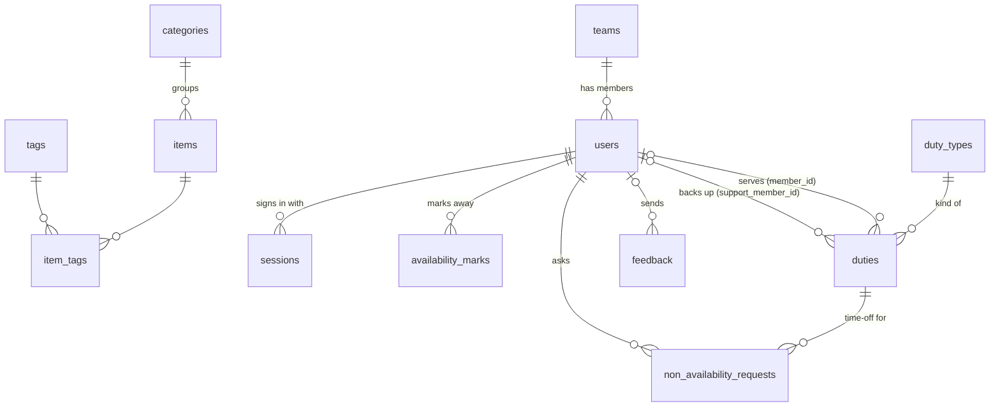

# Database architecture

Potters Portal keeps all of its data in one **PostgreSQL** database. The desktop
app and the REST API server (used by the mobile app) both read and write that
same database. Nothing is stored locally except per-computer preferences (theme,
language, database connection), which live in the operating system's settings
store.

| | |
|---|---|
| Engine | PostgreSQL 18 (Neon serverless Postgres) |
| Database | `neondb` |
| Hosting | Neon, AWS region `eu-west-2` (London) — see [network-and-hosting.md](network-and-hosting.md) |
| Schema changes | Numbered SQL files in [`database/migrations/`](../database/migrations), applied by [`database/migrate.py`](../database/migrate.py) |

## Data model at a glance

The schema has four areas: **inventory**, **people**, **scheduling**, and
**app features** (songs, feedback, access rights).



`songs` and `access_rules` stand alone (no foreign keys); `access_rules` refers
to members, teams and duty types by id (see below). `schema_migrations`
records which migration files have run.

## Tables

### Inventory

| Table | Purpose | Key columns |
|---|---|---|
| `items` | Church equipment | `name`, `description`, `quantity` (≥ 0), `location`, `status` (`available` / `missing` / `broken` / `lost`), `category_id`, `barcode` (unique when set), `image_data` (photo bytes, `bytea`) + `image_mime` |
| `categories` | One category per item | `name` (unique), `description` |
| `tags` | Labels, many per item | `name` (unique), `color`, `description` |
| `item_tags` | Item ↔ tag link | `item_id`, `tag_id` |

Photos are stored **inside the database** (`items.image_data`), so a database
backup includes them.

### People

| Table | Purpose | Key columns |
|---|---|---|
| `users` | A member profile and its login | `name`, `email` (unique, case-insensitive), `password_hash` + `password_salt`, `is_admin`, `color` (badge color), `team_id` |
| `teams` | Groups of members (Choir, Ushers, …) | `name` (unique, case-insensitive), `description` |
| `sessions` | Mobile/API sign-ins | `user_id`, `token_hash` (SHA-256 of the token, unique), `expires_at` |

A member belongs to at most one team. Passwords and tokens are never stored in
plain text — see [security.md](security.md).

### Scheduling

| Table | Purpose | Key columns |
|---|---|---|
| `duty_types` | Kinds of duty (Singing, Preaching, …) | `name` (unique), `icon` (emoji) |
| `duties` | One duty on one Sunday | `service_date`, `duty_type_id`, `member_id` (who serves; empty = unfilled), `support_member_id` (backup), `notes` |
| `availability_marks` | "I'm away that day" | `user_id`, `date` (one per member per date) |
| `non_availability_requests` | Time-off request for a specific duty | `duty_id`, `user_id`, `message`, `status` (`pending` / `approved` / `denied`), `decided_by`, `decided_at` |

### App features

| Table | Purpose | Key columns |
|---|---|---|
| `songs` | Worship song library | `title`, `artist`, `song_key`, `link`, `lyrics` |
| `feedback` | Bug reports, feature requests, profile-change requests | `kind` (`bug` / `feature` / `profile`), `member_id`, `subject`, `details`, `status` (`open` / `done`) |
| `access_rules` | Who may view / create / update / delete in each app section | `subject_kind` (`everyone` / `member` / `team` / `duty`), `subject_id`, `section` (`reports`, `songs`, `inventory`, `taxonomy`, `feedback`, `settings`), `can_view`, `can_create`, `can_update`, `can_delete` |

`access_rules` has one row per *(who, section)*. `subject_id` is a `users.id`,
`teams.id` or `duty_types.id` depending on `subject_kind` (0 for `everyone`).
A person's rights are everything allowed by the *everyone* rows, their own
*member* rows, their team's rows, and the rows of any duty they hold on the
upcoming Sunday, added together; Admins (`users.is_admin`) always have full
rights. The rules are read by `AccessController` (desktop and server).

## What happens when something is deleted

Foreign keys decide what happens to related rows, so the database stays
consistent whichever app does the deleting:

| When this is deleted… | …these are | Rule |
|---|---|---|
| a member (`users`) | their sessions, away marks and time-off requests | deleted (`CASCADE`) |
| a member | duties they serve or back up, feedback they sent, decisions they made | kept, with the member cleared (`SET NULL`) |
| a team | its members | kept, without a team (`SET NULL`) |
| a duty | its time-off requests | deleted (`CASCADE`) |
| a duty type | — | **refused** while any duty still uses it |
| a category | its items | kept, without a category (`SET NULL`) |
| an item or a tag | their `item_tags` links | deleted (`CASCADE`) |

`access_rules` rows aren't tied by foreign keys; rules for a deleted member,
team or duty type simply never match anyone again.

## Changing the schema

1. Add a new file in `database/migrations/`, numbered after the last one
   (e.g. `0026_add_something.sql`). Never edit a file that has already run.
2. Apply it:

   ```
   python database/migrate.py
   ```

   It reads the connection string from the `DATABASE_URL` environment variable
   (or `--database-url`), runs each new file in order inside a transaction, and
   records it in `schema_migrations` so it never runs twice.
3. Update the matching model, controller and view code (see
   [mvc-architecture.md](mvc-architecture.md)).

Migrations run against the **live** database — there is no separate test
database — so review a migration before applying it, and prefer changes that
only add (new tables, nullable columns) over ones that rewrite or drop data.

## Backups

Neon keeps a history of the database that can be restored to an earlier point
in time from the Neon console; how far back depends on the Neon plan. For an
extra copy, `pg_dump` with the same connection string produces a full backup
(including item photos).
