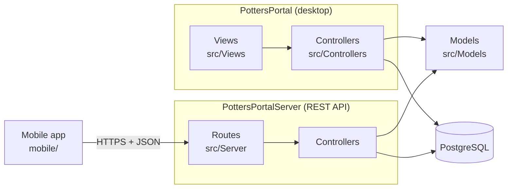

# MVC architecture

Potters Portal is a C++ / Qt 6 code base split into **Models**, **Controllers**
and **Views**. The models and controllers are shared by two programs built from
the same source:

- **PottersPortal** — the desktop app (Qt Widgets). Its views are the windows,
  tabs and dialogs.
- **PottersPortalServer** — the REST API (Qt HTTP Server) the mobile app
  talks to. Its "view" is JSON over HTTP.

A third client, the **mobile app** ([`mobile/`](../mobile), React Native /
Expo), never touches the database; it only calls the REST API.



## The three layers

### Models — `src/Models/`

Plain value classes, one per kind of record: `Item`, `Tag`, `Category`,
`User`, `Team`, `Duty`, `DutyType`, `Song`, `Feedback`, `AvailabilityMark`,
`NonAvailabilityRequest`, `AccessRights`, plus `ScheduleReportRow` for report
results. They hold data and small helpers (e.g. `DutyType::iconAndName()`,
`Feedback::kindKey()`), know nothing about the database or the screen, and
contain no Qt Widgets code — which is what lets the server reuse them.

### Controllers — `src/Controllers/`

One `QObject` per table or feature: `ItemController`, `TagController`,
`CategoryController`, `UserController`, `TeamController`, `DutyController`,
`DutyTypeController`, `SongController`, `FeedbackController`,
`AccessController`, `SessionController`, `AvailabilityController`,
`NonAvailabilityRequestController`.

A controller:

- runs the SQL for its table (prepared statements with bound values, through
  Qt SQL's `QPSQL` driver) and turns rows into models;
- enforces data rules that must hold everywhere — e.g. `DutyController`
  refuses changes to a Sunday that has passed, `UserController` never deletes
  or demotes the last Admin;
- reports failures through `lastError()` with a message fit to show a person;
- emits a `…Changed()` signal after every successful write
  (`itemsChanged`, `dutiesChanged`, `usersChanged`, …).

`Database/Database.cpp` opens the connection (from `DATABASE_URL` or the saved
connection) and reconnects transparently when Neon has closed an idle one.
`Auth/PasswordAuth` hashes passwords and session tokens. `AccessController`
works out what a person may do (see [security.md](security.md)).

### Views — `src/Views/` (desktop)

Qt Widgets: one class per tab or dialog.

| Tab | View | Main controllers |
|---|---|---|
| Schedule / Planning | `ScheduleTab` (+ `AssignDutyDialog`, `AddToScheduleDialog`, `MemberSundayDialog`, `MemberStatsDialog`) | Duty, DutyType, User, Team |
| Reports | `ReportsView` | Duty, DutyType, User, Team |
| Songs | `SongsView` (+ `SongEditDialog`) | Song |
| Inventory | `ItemListView` (+ item dialogs, `ItemFormWidget`) | Item, Tag, Category |
| Taxonomy | `AdminOverviewView` (+ member / team / tag / category / duty type dialogs) | User, Team, Tag, Category, DutyType |
| Feedback | `FeedbackView` | Feedback, User |
| Settings | `SettingsView` (+ `AccessRightsDialog`, `ChangePasswordDialog`) | Access, User |

Shared building blocks: `FramelessDialog` (base of every dialog),
`MessageDialog` (the app's message boxes), `ActionBar`, `Sidebar`, `TitleBar`,
`MemberBadge`, `MemberPickerField`, `SuggestLineEdit`, `ElidedLabel`,
`FlowLayout`. Look and feel come from one stylesheet with three themes in
`src/Style.cpp`; on-screen text goes through `tr()` and is translated from
[`src/translations/pottersportal_fr.ts`](../src/translations/pottersportal_fr.ts).

## How the pieces talk

**`MainWindow`** owns one instance of every controller and every tab, and
connects them:

1. A view asks a controller for data (`allSongs()`, `dutiesForDate(…)`) and
   draws it.
2. When the user changes something, the view calls the controller
   (`addSong(…)`, `updateDuty(…)`). Views never run SQL themselves.
3. On success the controller emits its `…Changed()` signal. `MainWindow` has
   connected that signal to the `refresh()` of every tab that shows the data,
   so all of them update — e.g. adding a member refreshes Taxonomy, Schedule,
   Reports and Feedback at once.
4. On failure the view shows `lastError()` in a `MessageDialog`.

`MainWindow::applyAccess()` signs people in and out, asks
`AccessController` what they may do, and passes each tab its rights
(`setAccess(…)`), which shows or hides that tab's buttons. It re-runs whenever
access rules, members or duties change.

On the **server**, each route in `Server/ServerMain.cpp` plays the view's part:
it checks the caller's token and rights, calls the same controller methods, and
turns the models into JSON (`Server/Json.cpp`).

## Directory map

```
src/
  Portal.cpp            desktop entry point: language, database connection, MainWindow
  Models/               value classes (shared)
  Controllers/          SQL + rules + change signals (shared)
  Database/             connection handling (shared)
  Auth/                 password and token hashing (shared)
  Views/                desktop windows, tabs and dialogs
  Server/               REST API routes, JSON, bearer-token check
  Vision/               Groq AI photo/question helpers, location lookup
  Mail/                 SMTP mail (password-change notices)
  Style.cpp, Language.cpp
  translations/         French UI text
database/migrations/    schema history (see database-architecture.md)
mobile/                 React Native app (separate repository, git submodule)
```

## Adding a feature, end to end

1. **Schema** — a new migration in `database/migrations/`.
2. **Model** — a value class in `src/Models/`.
3. **Controller** — queries, rules and a `…Changed()` signal in
   `src/Controllers/`; add both files to `CORE_SOURCES` in `src/CMakeLists.txt`.
4. **View** — the tab or dialog in `src/Views/`, added to the desktop target in
   `src/CMakeLists.txt`; wire it up in `MainWindow` (create, add to the sidebar
   and stack, connect change signals, pass access rights).
5. **API** (if the mobile app needs it) — routes in `Server/ServerMain.cpp`,
   JSON in `Server/Json.cpp`.
6. **Text** — build the `update_translations` target and add the French for
   any new strings to `src/translations/pottersportal_fr.ts`.
