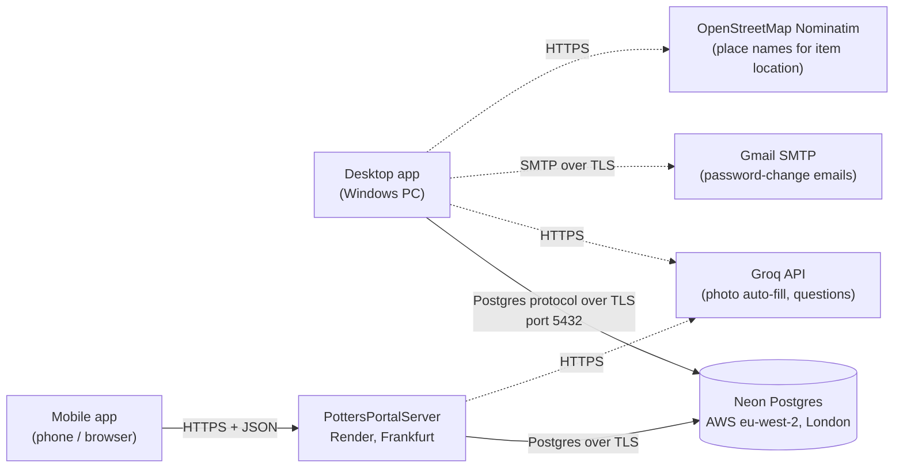

# Network and hosting

Where Potters Portal's data lives and how each part of the system reaches it.

## The database — Neon (cloud)

| | |
|---|---|
| Provider | [Neon](https://neon.tech) — managed, serverless PostgreSQL |
| Region | AWS `eu-west-2` (London, UK) |
| Engine | PostgreSQL 18 |
| Database | `neondb` |
| Address | a Neon endpoint `….eu-west-2.aws.neon.tech`, port 5432 (full details in the Neon console) |
| Connection | TLS required (`sslmode=require`) |

All data — items and their photos, members, schedules, songs, feedback,
access rules — is stored here; there is no other copy of the data in the
system. Neon *suspends* the database's compute after a period with no queries
and wakes it on the next connection, so the first request after a quiet spell
can take a second or two; the desktop app reconnects automatically when that
happens.

The connection string (host, database, user and password) is the key to the
data. It is **not** in the repository: developers keep it in the
`DATABASE_URL` environment variable, and installed desktop copies ask for it on
first launch (see [installing.md](installing.md)). How it is protected is in
[security.md](security.md).

## The desktop app — talks to the database directly

The Windows desktop app connects **straight to Neon** over the internet using
the Postgres protocol (TCP port 5432, TLS-encrypted). It does not go through
the REST server. Any network that allows outgoing connections on port 5432
works; some restrictive networks (e.g. some company or school Wi-Fi) block that
port, in which case the app can't load data there.

## The REST API — PottersPortalServer on Render

The mobile app can't hold database credentials safely, so it talks to
**PottersPortalServer**, a small HTTP/JSON API built from the same C++ code
(see [mvc-architecture.md](mvc-architecture.md)), which in turn talks to Neon.

The repository is set up to host it on [Render](https://render.com):

- [`Dockerfile`](../Dockerfile) builds the server into a Debian Linux container
  running as an unprivileged user.
- [`render.yaml`](../render.yaml) describes the Render service: free plan,
  Frankfurt region (the closest to the London database), health check at
  `/api/health`, automatic deploys from the repository.
- `DATABASE_URL` and `GROQ_API_KEY` are entered as secret values in Render, not
  stored in the repository.

Render serves the API over **HTTPS** on its own `onrender.com` address and
forwards to the container's port (`PORT`, default 8080). On the free plan the
service sleeps when idle and takes some seconds to wake on the next request.

### During development

When the server runs on a developer's PC instead (`PottersPortalServer.exe`,
port 8080), the mobile app reaches it:

- on the **same Wi-Fi**: at the PC's local IP address (picked up automatically
  by Expo Go), after allowing port 8080 through Windows Firewall;
- from **anywhere else**: through a temporary `cloudflared` tunnel, which gives
  the local server a public `https://…trycloudflare.com` address
  (see [`mobile/README.md`](../mobile/README.md)).

## Other services the apps call

| Service | Used for | Called by | Transport |
|---|---|---|---|
| Groq API (`api.groq.com`) | Filling in an item's name and description from its photo; answering inventory questions | desktop, server | HTTPS, API key in `GROQ_API_KEY` |
| Gmail SMTP | Emailing the new Admin password when it's changed | desktop | SMTP over TLS, credentials in `SMTP_USERNAME` / `SMTP_PASSWORD` |
| OpenStreetMap Nominatim | Turning the PC's position into a place name for an item's location | desktop | HTTPS |
| Windows Location Services | The PC's position for the above | desktop | local (Windows API) |

All of these are optional: without the keys the related feature reports that
it isn't set up, and the rest of the app works normally.
